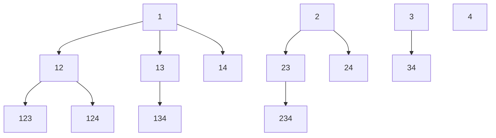

# 0077 Combinations

Problem: Return an array of arrays of k-combinations of n items.

Example: [1,2,3,4] -> [[1,2], [1,3], [1,4], [2,3], [2,4], [3,4]]

## #backtracking, #recursion, #array

Solution:

Set a combinations array.
Set another temp array for the current combination being built.

```js
var combine = function (n, k) {
  let combs = [];
  let current = [];

  const reverse = (combs, current, start, n, k) => {
    if (k === 0) {
      //console.log("bottom", current);
      combs.push(Array.from(current));
      //console.log("combs at bottom", combs);
      return;
    }

    for (let i = start; i <= n; i++) {
      current.push(i);
      //console.log("before recursion", current);
      reverse(combs, current, i + 1, n, k - 1);
      current.pop();
      //console.log("after recursion", current);
    }
  };

  reverse(combs, current, 1, n, k);
  //console.log("answer", combs);
  return combs;
};
```

The idea is that the for loop adds an index to the current combination and then calls the reverse function again with index + 1.

Recursive branches terminate either because k = 0 or because i>n and the loop does not spawn more recursive calls. 

In the recursion diagram below, only nodes with three digits push an element to the final "combs" array.



